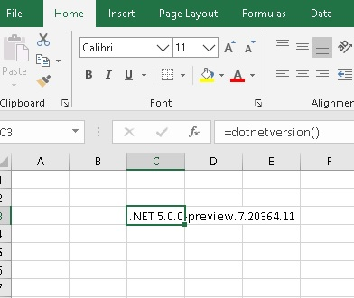

| dev | master | prerelease | release |
|:----------:|:----------:|:----------:|:--------------:|
|| |||

__Possible [regression](https://github.com/dotnet/msbuild/issues/5637) in VS2019 is causing build problems__ 


### [xlw nuget](https://www.nuget.org/packages/xlw/)
### [xlwDotNet nuget](https://www.nuget.org/packages/xlwDotNet/)


# **XLW**
xlw is being updated.

This repo was originally forked from [John's XLW repo](https://github.com/JohnAdders/xlw) which itself was imported from it's original home at [SourceForge](https://sourceforge.net/projects/xlw/)


This version will only support Visual Studio 2019 for now. Support for all previous Visual Studio versions has been dropped. All support for gcc has also been dropped.

Support is being added for building xlls against .NET CORE & .NET Framework 4.7.2


An initial dev nuget package  for building C/C++ xlls is avaialable at [xlw@nuget](https://www.nuget.org/packages/xlw/).\
And a nuget package for building C# xlls is available at [xlwDotNet@nuget](https://www.nuget.org/packages/xlwDotNet).

---

## xlw
xlw for building C++/C xlls has not changed much at this point.
To build a C++ xll :
1. Create an empty C++ DLL project.
2. Add the xlw nuget package.

*Required MSVC Toolset v142

---

## xlwDotNet
Only VS2019 is supported right now. 
To build a C# xll :
1. Create a new .NET Core library project. 
2. Open the .csproj file with a text editor and set the  `TargetFramework` and  `Platform` for example
```xml
<Project Sdk="Microsoft.NET.Sdk">
  <PropertyGroup>
    <TargetFrameworks>net5.0</TargetFrameworks>
    <Platforms>x64</Platforms>
  </PropertyGroup>
</Project>
```
3. Add the xlwDotNet nuget package.
4. Add a C# source file, for example :
```csharp
using System;
using xlwDotNet;

namespace TestxlwDotNetNuget
{
    public class Class1
    {
        [ExcelExport("Hello World")]
        public static String HelloWorld()
        {
            return "Hello World!";
        }

        [ExcelExport("Bye World")]
        public static String byeWorld()
        {
            return "Bye World!";
        }

        [ExcelExport("Get's .NET Version")]
        public static String dotnetversion()
        {
            return System.Runtime.InteropServices.RuntimeInformation.FrameworkDescription;
        }
    }
}
```
5. Build the project. If your project was named MyProject then you will see in the output directory xlwMyProject.xll. You can open the xll and call the function `dotnetversion`

_Note : You can set the TargetFramework to net472, netcoreapp3.1 or net5.0._
_You must set the platform to x64 or x86 and you should delete the configuration for AnyCPU from your solution_



<sup>*Excel 2019</sup>

The output are:

| TargetFramework  | xll  | Output  |
| ------------- |:-------------:|:-------------:|
| net472        |xlw\xlwDotNet\Template_Projects\VS16\Addin\Debug\x64\net472\Template.xll |.NET Framework 4.8.4084.0 |
| netcoreapp3.1        |xlw\xlwDotNet\Template_Projects\VS16\Addin\Debug\x64\netcoreapp3.1\Template.xll |.NET Core 3.1.2|
| net5.0        |xlw\xlwDotNet\Template_Projects\VS16\Addin\Debug\x64\net5.0\Template.xll |.NET 5.0.0-preview.7.20364.11|


